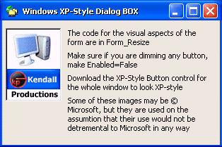



## Windows XP\-Style Dialog Box

### Description

This template form allows programmers to let their programs have the new look of Windows XP without coding a new user interface.
 
### More Info
 

             |
---                |---
**Submitted On**   |2002-06-26 13:43:08
**By**             |[Will Kendall](https://github.com/Planet-Source-Code/PSCIndex/blob/master/ByAuthor/will-kendall.md)
**Level**          |Intermediate
**User Rating**    |4.5 (18 globes from 4 users)
**Compatibility**  |VB 6\.0
**Category**       |[Custom Controls/ Forms/  Menus](https://github.com/Planet-Source-Code/PSCIndex/blob/master/ByCategory/custom-controls-forms-menus__1-4.md)
**World**          |[Visual Basic](https://github.com/Planet-Source-Code/PSCIndex/blob/master/ByWorld/visual-basic.md)
**Archive File**   |[Windows\_XP990546262002\.zip](https://github.com/Planet-Source-Code/will-kendall-windows-xp-style-dialog-box__1-36289/archive/master.zip)

